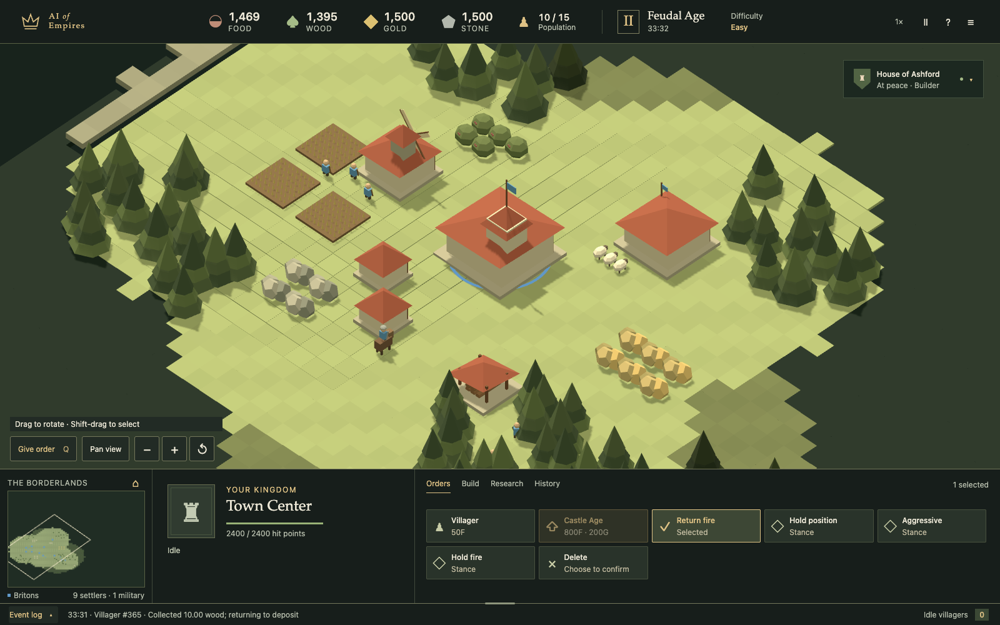
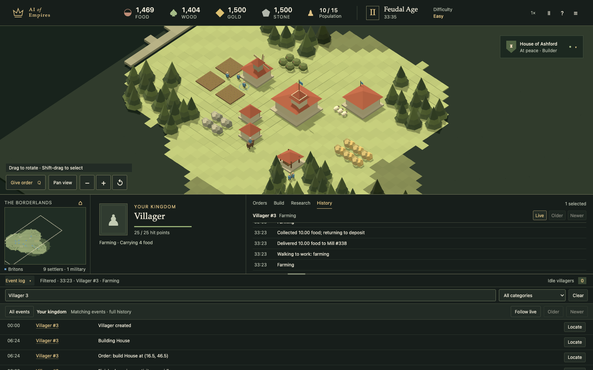
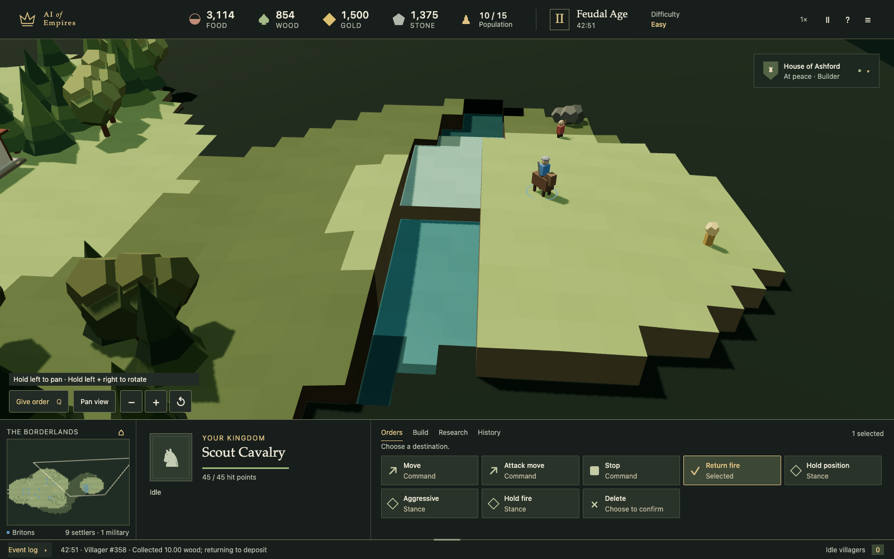
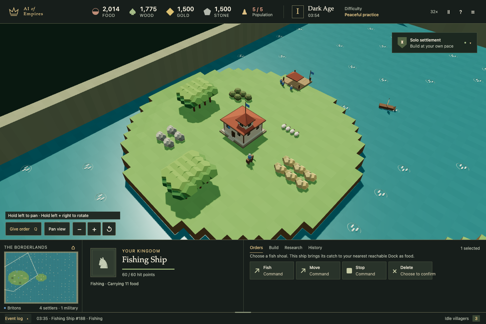
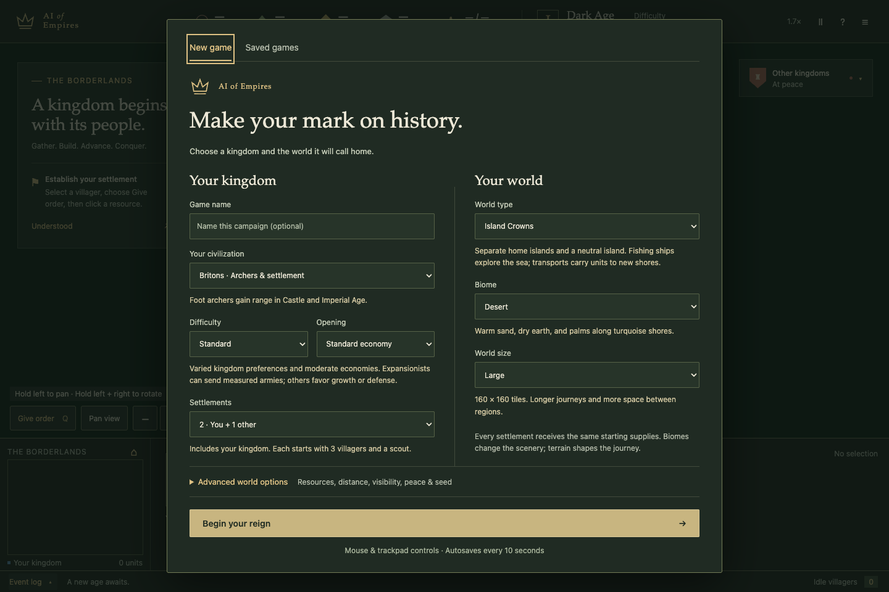
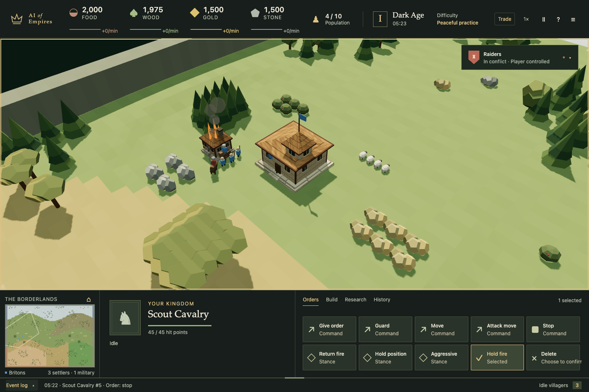
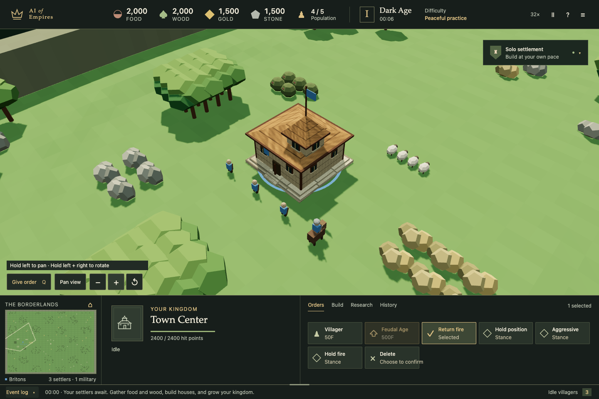
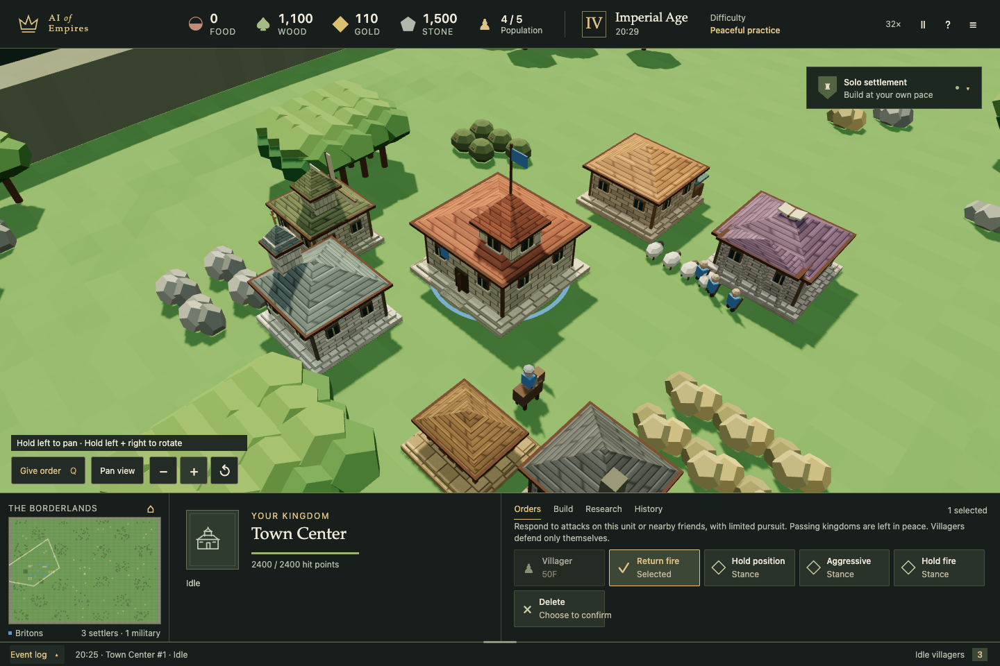

# AI of Empires

A playable historical RTS with a Go server and a Three.js battlefield. Go owns the simulation, AI, visibility, resources, pathfinding, combat, and outcomes. The browser renders snapshots and sends player intentions.

## Gameplay

Grow a settlement with farms, resource camps, homes, and military buildings.



Follow each villager's current activity and immutable history, and search the live event log to locate individual entities.



Rotate and tilt the perspective to explore raised ground, recessed rivers, and exposed banks.



Build a maritime economy with visible fish shoals and Fishing Ships that deliver food to Docks.



## Run

Use Go 1.26 (or Go with automatic toolchain downloads enabled) and Node.js 22.12+.

```sh
make run
```

Open **http://127.0.0.1:9090**. This installs the locked frontend dependencies, builds the UI, and starts the Go server with the UI embedded. No external assets or CDN requests are needed at runtime.

To build a standalone executable:

```sh
make build
./bin/ai-of-empires
```

The server defaults to `127.0.0.1:9090` and stores each game in **`data/ai-of-empires.sqlite.games/<game-id>.sqlite`**. `data/ai-of-empires.sqlite` is the host catalog for deletion markers. Use `-addr` to change the address and `-db /path/to/host.sqlite` to change the catalog and its adjacent `.games/` directory. `-db :memory:` creates a separate disposable SQLite database for each game.

For frontend development, keep the Go server running and run `npm --prefix web run dev`; Vite proxies `/api` to Go. Restart the Go server after rebuilding embedded assets when testing the production page.

## Play

Choose a civilization, optional game name, and **1–6 settlements including yours**. One settlement is solo play. Choose how many additional seats to reserve for friends; the rest use AI. Creation opens a saved private lobby. The owner can start immediately, even with unclaimed friend seats or players who have not marked Ready. Ready is an optional coordination signal. Unclaimed human kingdoms start on the map without AI and stay available for friends to join later; issuing or accepting their first invitation does not pause play. Each starts with one Town Center, three villagers, and one scout. Choose world size independently of settlement count. Sandbox begins with extra resources; peaceful difficulty disables the opponents' AI.

World creation separates kingdom settings from geography, with advanced options for resources, distance, visibility, peace, and seed.



Create a world from twelve presets:

| World | Geography |
|---|---|
| Open Plains | Open country, scattered woods and exposed resources |
| Forest Marches | Dense woodland, clear starting areas and connecting paths |
| Highland Relics | Hills, steep ridges, passes and central relics |
| River Kingdoms | Winding river, shallow crossings and fishing |
| Twin Seas | Two inland fishing lakes with land routes around them |
| Coastal Frontier | Shared mainland beside a broad sea |
| Island Crowns | Separate home islands and a neutral central island |
| Walled Basin | Palisades and four owned gates around each starting settlement |
| Mountain Lakes | High plateaus, ridges, sheltered lakes and connecting land passes |
| Braided Wetlands | Winding channels, wooded floodplains and shallow crossings |
| Northern Fjords | Deep sea inlets and a mountainous shared mainland |
| Scattered Archipelago | Irregular home islands and smaller offshore islets |

Choose **Temperate, Desert, Alpine, Tropical, Autumn Woodland, Savanna, or Mixed Regions**. Mixed Regions is the default for new worlds. Countryside deposits specialize by biome: deserts favor gold, alpine regions stone, tropical and autumn forests timber, and savannas natural food. The Marketplace’s Resources page shows Go’s exact multipliers. Starting stockpiles and home resource patches remain equal; farms and fishing keep their own rules. Existing saves retain their generated deposits. Geography and regional shortages create opportunities for exploration, specialization, and trade; civilization bonuses still apply.

World sizes are **Small (96×96), Medium (128×128), Large (160×160), Huge (224×224), and Giant (288×288)**. Huge provides nearly twice Large's area; Giant provides 3.24 times its area. Settlement count remains independent of size. Regional terrain and world settings survive autosave, resume, and portable archives.

Every one of the **21 building types has its own icon** in Build and its selection portrait. Buildings also have distinct material palettes and recognizable details, such as archery targets, stable stalls, a university portico, and a domed Wonder. Textures evolve through all four ages: coarse daub, thatch and timber in Dark Age; plaster and colored tiles in Feudal Age; dressed stone in Castle Age; finer masonry and roof finishes in Imperial Age. Existing buildings update when their owner's age advances. Unseen enemy buildings retain their last observed appearance.

Damage visibly changes the battlefield: buildings darken, crack, shed rubble, lose roof sections and burn; wounded infantry lean and limp, carts sag, and damaged ships list with torn sails. Repairs and healing restore their appearance. Go supplies the damage stage and confirms destruction before the browser shows a collapse or wreck. Remains last 12 game seconds for buildings and six for units, obey fog and freeze when paused. Fire and limping are cosmetic; they do not add damage or change movement speed. Reduced motion keeps the condition readable with static poses.



The same Town Center in Dark Age, then Imperial Age after developing the settlement through normal gameplay:





Open **Advanced world options** for natural resource abundance (70%, 100%, or 175% deposit amounts), starting separation, map reveal, seed, and an initial peace period of **0, 5, 10, 20, or 30 game minutes**. Natural abundance does not change starting stockpiles or farm yields. Terrain revealed shows geography while units and resources still require scouting; Everything visible reveals the world to every kingdom. Starting separation keeps a minimum clearance for each home economy, so crowded Small worlds limit how close starts can be.

During the initial peace period, Go blocks attacks, conversions and damage between kingdoms, including automatic attacks and AI raids. The top bar shows the remaining game time. Expiry permits conflict without declaring war. World settings and the timer survive autosave and resume; existing saves retain their original terrain.

River, lake, coastal and island worlds contain finite **Fish Shoals** in every biome, including fish near each kingdom’s nearest water. Build a **Dock** (150 wood) at an explored shoreline, train a **Fishing Ship** (75 wood), then select it, choose **Fish**, and click a shoal. Each standard shoal contains 400 food; natural abundance scales this amount. Ships carry catches to a reachable Dock, where they become **Food**. Depleted shoals disappear from the map. Docks and Fishing Ships are available in Dark Age.

In **Feudal Age**, build a **Market** (175 wood) and open **Trade** in the top bar. The ongoing marketplace supports standing buy, sell, and barter offers between kingdoms. Choose what you offer and request per lot, up to 20 lots and 12 open offers. Posting reserves the advertised goods; cancellation releases unclaimed lots. Publish to everyone or address a private offer to one kingdom.

Explore the offering trading post and train a **Trade Cart** at your Market or a **Trade Ship** at your Dock (both 100 wood, 50 gold, available in Feudal Age). Carts connect Markets over land; ships connect Docks over water. Docks support the same standing offers and merchant exchanges. An idle, empty carrier beside its matching home post can accept one lot, carrying up to 500 of each resource on its respective leg. Payment reaches the seller at pickup; purchased goods reach you on return. Enable repeated trips to continue while the offer and funds remain available. Stop/move interrupts delivery; **Resume caravan** continues without charging twice. **Recall caravan** before pickup releases the seller’s goods and brings your payment home. Peaceful trading partners grant the assigned cart gate passage, without shared vision or general military access. Contracts, cargo, offers and merchant stock survive saves and restarts.

The **Merchants** page compares local prices and lets you select home merchants or a visible neutral Market or Dock. Each kingdom has one home inventory shared by its owned Markets and Docks; each neutral post has its own. New maritime maps include neutral trading Docks where coasts permit. Buying raises prices and selling lowers them within price bounds. Regional Supply Caravans bring biome-dependent food and wood production and limited-rate stone imports. Buyers accompanying them consume goods and pay from a bounded budget. Supplies arrive physically, can be blocked or attacked, and wait at least 90 game seconds between shipments. This sustains commerce after deposits decline while retaining local shortages.

**Export** carries 100 goods to a neutral Market or Dock and returns payment; **Import** carries payment and returns 100 goods. Both sides reserve stock at dispatch, fixing that trip's price. Repeat controls can enforce minimum sale or maximum purchase prices. Profit comes from meeting demand and differences between local prices; distance adds travel and risk. The server shows indicative price margins, stock, output, demand and supply status. Home exchanges remain immediate in your selected Market or Dock’s Trade tab. Rebuilding Markets never resets inventory.

Select soldiers or warships, choose **Guard**, then click a friendly villager, trade carrier, Market, Dock or neutral Supply Caravan. Soldiers escort on land and warships at sea. Guards follow, engage nearby hostile forces or witnessed attackers, and return to their protected target after combat. They keep a short pursuit leash; Hold fire suppresses their automatic attacks. Stop or another order interrupts guarding. Guarding never grants foreign vision or military gate access.

Destroying a loaded economic unit immediately transfers its carried resources to the kingdom that lands the killing blow. This includes villagers’ gathered cargo, trade payment or purchased goods, and a Supply Caravan’s goods and buyer cash. Sunk transports also surrender their passengers’ resource cargo. Empty buildings and kingdom treasuries are not loot. Uncollected trade reservations return to their original owner; captured cargo cannot also be delivered or paid twice. Spoils appear in the attacker’s private event log and do not count as production.

Built-in AI kingdoms compare observed prices, fund land or sea deliveries, and assign up to two nearby idle military escorts to loaded trade carriers. Raiders consider visible defending strength, so a strong escort can deter an unfavorable raid. AI uses the same commands, costs and visibility as humans and MCP agents. Automatic matching of separate offers, negotiated alliances and military access treaties remain future work. See [marketplace rules and API examples](docs/MARKETPLACE.md).

In Feudal Age, train a **Transport Ship**, bring it alongside land, order units to garrison it, sail to another shore, and choose **Unload**. Active AI economies can fund docks and two fishing ships. On islands they can explore by sea and use transports for bounded raids or safe Castle Age expansion. They pay normal costs and use the same boarding and unloading rules; builder kingdoms do not launch raids. Full naval fleet strategy and negotiated diplomacy remain future work.

Choose **Peaceful practice**, **Easy**, **Standard**, **Hard**, **Extra hard**, **Expert**, or **Aggressive** when starting a match. The current difficulty stays in the top bar. Each active AI also has a seeded **Builder**, **Defensive**, or **Expansionist** preference. Builders prioritize growth and a small defensive force; defensive kingdoms may counter-raid a kingdom already attacking them; expansionists can start profitable conflicts. Higher difficulty increases their budgets and planning pressure without making every kingdom expansionist. Aggressive explicitly makes all AI expansionist, with possible raids after one game minute. Expert researches upgrades. All levels use the same starting population, resources, costs, production clock, and gathering rules as the player; civilization bonuses apply equally. The AI automatically queues villagers and assigns work, so its economy can grow more consistently than a manually managed settlement.

**Easy** develops one Town Center and up to **12 villagers**, spaces villager orders by the normal training duration plus 15 game seconds, and budgets **8 military units including queued production**. It sends at most **4 units per raid**, waits until **10 game minutes** before launching, and leaves at least **4 game minutes between launches**. It can defend itself sooner. These are game-clock times; increasing speed accelerates every kingdom equally. Raids have fixed rosters, so new soldiers cannot turn a small party into an endless stream. Existing units in older saves remain alive; excess AI training queues are refunded, and future orders obey the new limits.

Kingdoms start **at peace**. Passing troops do not trigger combat or an AI defense. Actual attacks and conversion attempts start a conflict only between the kingdoms involved; five game minutes without attacks restore peace. The kingdom panel above the world lists each neighbor's relationship with you and preference. AI kingdoms pursue their own interests and evaluate human and AI opponents equally. Unfavorable raids give way to development, and costly expeditions retreat. Above Easy, developed economies can expand to safe, observed deposits in Castle Age. Strategies use current vision and remembered buildings, without access to hidden armies, resources, or other kingdoms' starting coordinates. Formal alliances, negotiated treaties, and shared vision remain future work.

Military units and armed buildings default to **Return fire**. Idle defenders respond to actual recent attackers of themselves or nearby friends, with a six-tile pursuit limit around the defense position; villagers defend only themselves when idle. They do not target innocent units just because they belong to the attacker's kingdom. **Hold position** returns fire within range without pursuit; **Hold fire** disables automatic response; **Aggressive** opts into proximity attacks. Explicit **Attack**, **Attack move**, and hostile contextual orders can start conflicts regardless of the automatic stance. A normal Move order continues to its destination. AI raids target one chosen kingdom along their route and may defend against others that actually attack them.

- **Click** to select an element. **Hold the left mouse button briefly, then drag** to pan (180 ms hold delay), keeping selected units and pending orders. A subsequent click still gives the armed order; a pan never issues it. The Stone Wall/Palisade tool uses dragging to draw walls. **Hold both left and right mouse buttons**, then drag left/right to rotate or up/down to tilt; release either button to stop. **Shift + arrow keys** also rotate and tilt, including on a trackpad. **Shift-click** adds or removes a selection, and **Shift-drag** selects a group, replacing your previous selection.
- Select your units, choose **Give order** in the **Orders** panel (or press **Q**), then click a resource, entity, or destination. The same control sets a selected building's rally point when you click the ground.
- For quick orders, use **Option/Alt-click**, **Control-click on Mac**, or **right-click** with a mouse. Secondary click on a trackpad works too if enabled. No secondary click is required to play.
- Hold **Shift** while issuing orders to queue them and keep targeting. Click **Cancel** or press **Escape** to return to selection.
- Select villagers and open **Build** to place a building. Go checks the site and charges the cost.
- Hover over a building to see its type and activity. Select it to train units, research, advance ages, or cancel queued work. New units emerge in clear spaces beside their own producer; a blocked exit waits for room. Units route around occupied space and steer past nearby traffic.
- **H** selects the Town Center; **.** selects idle villagers; **A** starts attack move; **S** stops selected units.
- Press **P**, then drag to move across the map. Press P again or Escape to return to normal selection and camera gestures. Arrow keys, middle-drag, and clicking the minimap also pan, following the current camera angle. **Scroll or pinch** to zoom around the ground under your cursor; **+ / − keys** zoom around the center of the view. Zoom extends to a strategic overview, scaling further for Huge and Giant worlds. The floating camera toolbar is removed; active-order instructions appear in the command deck.
- **R** restores the starting camera angle and zoom at your current location. **H** returns to your Town Center. Camera gestures preserve your selection and send no gameplay commands.
- **Cmd/Ctrl + a number** assigns a control group; the number recalls it. To remove a selection, choose **Delete**, then **Confirm removal**; Delete or Mac Delete/Backspace also confirms while removal is armed.
- Space pauses; the speed button cycles through 1×, 1.7×, 3.4×, 8×, 16×, and 32×. The match menu lets you choose a speed directly.
- Selected entities display their current activity (farming, logging, mining, and more). Choose the **History** tab after **Research** to read that entity's immutable log in the command panel, retained even after removal. The global tray stays independent.
- Select a depleted **Farm**, then choose **Reseed farm** in Orders. It costs **60 wood**, assigns an existing farmer or the nearest idle villager on connected land, and rebuilds the farm before farming resumes. The action explains missing wood or workers. Assigned farmers also reseed automatically while wood is available; selecting a villager and ordering it onto an empty farm still works. Empty fields visibly lose their crops.
- **Event log** at the bottom expands the live kingdom chronicle. Drag its top edge to resize down to one line; with the edge focused, use arrows to resize or Home to collapse. **Older / Newer** browse history and **Follow live** returns to new events.
- Search the full retained log by activity, message, resource, or exact identity (for example, **villager 3** or **#3**). Combine search with the event category selector. **Locate** centers the camera on that entity and opens its History tab; for entities no longer visible it visits the event's recorded location. Entity names filter the tray to their history. **Clear** or **All events** removes the filters.

Stone Walls and Palisades support **click-and-drag construction**: select villagers, open **Build**, choose the wall, drag a line, and release. Go previews connected segments and the total cost, then validates and queues the entire line (up to 64 segments). An obstructed or unaffordable line creates no partial foundations. Existing friendly walls/gates can anchor a line. Stone Gates can replace owned wall or palisade segments in a straight section, or stand alone with walls connected along one axis. Completed gates admit their owner's units and block other kingdoms; destroying a wall or gate opens a breach.

The four resource totals have small production charts underneath. Rates measure **gross resources delivered per game minute**, including harvesting/fishing and relic income. Imported goods and sale proceeds are exchanges, not production. Spending, refunds and market exchanges do not count as production. Go samples every five game seconds, showing a rolling one-minute rate and five minutes of history. Pausing freezes the series, and saves preserve its samples and partial bucket.

Gameplay and entity histories are private to the authenticated member. Each event carries an immutable user identity and kingdom ID. Seeing an enemy does not grant access to its activity log; your own discovery and damage reports remain in your history. Reclaiming another member's seat does not reveal their records.

## Saved games

Games autosave every **10 seconds**, on **Save now**, before **Leave game**, and during graceful shutdown. The **Saved games** tab lists only memberships bound to this browser. Search by name or session ID, then choose Resume or Manage. Names can repeat; each game has a permanent ID.

In the lobby, use **Invite player** to create a link for one friend seat. The friend explicitly joins; previews do not consume invitations. Links expire after 24 hours and can be revoked. Each player gets a private **rejoin code**. Save your own code from **Players & game management → Your private rejoin code** to recover the same kingdom in another browser or on another host. A game name or ID alone grants no access. Browser credentials and recovery/invite secrets are stored as hashes on the server.

Any player can pause. Only the owner can start, resume, change speed, close, move or delete. Closing a tab leaves its seat owned. A player who joins and then disconnects pauses the game after a **15-second grace period**; silent crashes are first detected by a 12-second heartbeat timeout. Multiple tabs count as one connected player. Empty seats do not trigger a pause; pressing Start also acknowledges any claimed players who are currently absent. When everyone leaves, Go pauses, checkpoints and unloads the game. Rejoining never resumes automatically. The owner can explicitly continue while someone is absent; human kingdoms never become AI automatically.

Open **Players & game management** from the match menu, or **Manage** beside a saved game. **Close game for everyone** freezes and saves it; **Reopen game** restores unfinished play paused. **Delete game** requires explicit confirmation and removes this host's saves, memberships, invitations and history. Exported archives and external backups remain outside that deletion. A failed close keeps the world frozen and offers Retry or Cancel.

Server restart restores unfinished games **paused**, with no offline time. Checkpoints preserve orders, queues, cargo, physics, fog, RNG, AI, relationships, world options, all gameplay lifecycles, immutable journals, memberships, and command receipts. Version-1 through version-7 world checkpoints remain readable; version-5 merchant stocks migrate without duplication. The original browser's saved token automatically upgrades an older local game to a private owner membership without changing its world. Unauthenticated name-based recovery is retired.

**Ctrl+C or SIGTERM** starts graceful shutdown. The server freezes game mutations, rejects new requests, and closes live snapshot streams. HTTP requests get **5 seconds** to drain before remaining connections are closed. Final checkpoints use a separate **15-second I/O budget**, retry transient SQLite lock contention, and finish before SQLite closes. A request authorized before shutdown cannot change a game after its final save. Repeated signals do not interrupt that save. Shutdown logs the result and exits with status **1** if draining or saving fails; a failed checkpoint leaves the previous committed save intact. Forced termination (`kill -9`) or power loss can still lose progress since the last successful checkpoint.

Each game's file contains its checkpoint, full immutable journal, production history, roster, credential hashes, browser recovery bindings, command receipts, and saved move/copy archives. Existing combined libraries migrate automatically at startup: each full game commits to its own file before its old rows are removed. Interrupted migrations resume after verifying all copied tables. Older shared events and friend-seat records without user IDs remain archived privately, since those seats may have changed hands; they are not exposed as another player's history.

To move a game as a single SQLite file:

1. In **Players & game management → Move or copy this game**, choose **Download SQLite save**, or gracefully stop the source server and copy that game's `.sqlite` file.
2. Stop the source game/server when relocating it so two hosts do not advance independent copies.
3. Put the file in the destination's `<catalog-path>.games/` directory (create it if needed), then start that server. No catalog file or SQLite sidecars are required.
4. Open the destination address and rejoin using each player's private rejoin code. The game opens paused.

Database downloads are owner-only administrative backups containing every kingdom's private state and recovery credentials; keep them private. Downloads use a consistent SQLite snapshot and stream the file. Game files use rollback journals; copy an original file only after a graceful stop, not during a live transaction. The host catalog retains deletion markers so copying a deleted game back onto the same host cannot resurrect it. The SQLite format is versioned; unsupported checkpoints fail explicitly rather than starting a replacement game.

## Move a game or play on a LAN

1. Open **Players & game management → Move or copy this game**. Optionally enter an archive passphrase (8–256 characters). Choose **Move game**, then **Freeze and download**. The source stays frozen.
2. On the destination server, open **Saved games → Import a game archive**. Select the `.aoegame` file, enter its passphrase if protected, and prove ownership with the owner's private rejoin code.
3. The destination keeps the original game, kingdom and membership IDs and opens paused. Share its address; friends use their own rejoin codes. The owner explicitly resumes.
4. Copy the destination's completion receipt back to the original host to retire it, or leave the original frozen during an offline handoff.

**Copy as new game** creates an independent archive import with a new game ID and fresh player access. Archives contain private world data and histories; protected exports use AES-256-GCM with a PBKDF2-derived key. Imports are limited to 64 MB (128 MB expanded). Reimporting the same move on one host is idempotent. A deleted game's archive can only return as an explicit new copy. Offline copies cannot be globally fenced without a coordinator; cancel a move only after ensuring the destination is not running it.

For a LAN, start the same executable on a reachable interface:

```sh
./bin/ai-of-empires -addr 0.0.0.0:9090 -db data/ai-of-empires.sqlite
```

Friends open `http://<your-computer-address>:9090`. No external login provider is required. For public hosting, serve the application through HTTPS. This host currently allows visitors to create private games and import archives they own; operator quotas, accounts and public matchmaking are future work. Changing hostnames or LAN IPs requires a new link and authentication on that origin.

## Architecture

| Boundary | Ownership |
|---|---|
| `internal/game` | Fixed 50 ms simulation steps, rules, AI, state machines, player read models |
| `internal/matches` | Player memberships, lobbies, invitations, clocks, shared controls, scoped receipts, SQLite checkpoints and portable archives |
| `internal/httpapi` | Strict JSON transport, authentication, REST commands, player MCP tools, SSE snapshots, static serving |
| `web/src` | Three.js geometry, camera, snapshot interpolation, selection, HUD, input |

All gameplay lifecycles use [`open-ships/statemachine`](https://github.com/open-ships/statemachine), with one `Instance` owning each state. Guards observe; transition effects mutate; the tick loop emits events. See [the lifecycle design](docs/STATE_MACHINES.md).

The [API guide](docs/API.md) describes requests and reconnect behavior. [OpenAPI](api/openapi.json) and [TypeScript wire types](web/src/api.generated.ts) are generated from Go DTOs with `go run ./cmd/contracts`. Internal aggregates never become client authority. Action labels, costs, exchange gains, availability, and refusal reasons come from the backend.

The [multiplayer lifecycle and API guide](docs/MULTIPLAYER.md) diagrams the implemented friend seats, invitations, shared controls, and portable games.

Agents can play through a **separate MCP endpoint for each player membership** at `/api/v1/games/{game}/memberships/{member}/mcp`. Get your URL and restricted token with authenticated `POST /api/v1/games/{game}/agent`. An assistant can share your kingdom, or an opponent can claim an invited friend seat. The 16 tools expose all 33 multiplayer command kinds, placement, private observations/history and shared controls through the existing Go authority. Agent credentials cannot authorize REST administration or database downloads. See [MCP setup, privacy and gameplay coverage](docs/MCP.md), including the heartbeat requirements for unattended play.

## Implemented scope

The `frontier-1` ruleset includes twelve seeded world layouts, seven biome choices including mixed regions, five world sizes, initial peace periods, four ages, construction and repair, resource cargo and drop-off, farms, research and production queues, population limits, combat and projectiles, monks and relics, garrisoning, biome scarcity, standing commodity offers, caravan delivery, local merchant prices, regional supply caravans and consumer demand, siege deployment, ships, fog of war, server AI, and conquest/wonder victory. Thirteen civilization choices have simplified bonuses and unique units. All visual models and textures are original procedural assets. A perspective camera, continuous terrain with exposed banks and cliffs, soft directional shadows, and buildings detailed on multiple sides give the battlefield depth. Terrain relief is visually amplified from the server’s elevation data; movement, terrain rules, and height advantages remain in Go.

This is an initial playable ruleset. Its values and civilization availability are **not verified Age of Empires parity**. [GAME_SPEC.md](GAME_SPEC.md) remains the larger product target: full civilization trees, campaigns, scenario editing, public matchmaking, replay playback, audio, formations, complete reference rules, and large-army performance certification remain future work.

Up to 16 games can be loaded at once, with up to six human/AI kingdoms each; unloaded saved games remain in SQLite. Browser-only offline simulation is excluded by the Go authority requirement. Current deterministic checks cover checkpoint continuation and repeat runs of this Go implementation; cross-platform replay equivalence is not established, and simulation quantities currently use `float64`. Pre-persistence builds cannot export their in-memory games into the new checkpoint format.

High speeds use independent game clocks with small fixed-step batches, background autosave encoding and disk writes, and a 20 Hz stream of changed observations. The renderer buffers observed movement, caches minimap terrain, and updates only changed terrain chunks. Fully revealed maps skip redundant fog-memory projections. Earlier fixes include failed-route retry timers, spatial path obstacles, shared catalogs, reusable rings/projectiles, and batched farm crops. Browser history pages remain bounded; complete immutable journals intentionally accumulate in the backend and database. See [performance measurements](docs/PERFORMANCE.md).

## Validate

```sh
make check
```

This checks generated contracts, TypeScript, Go vet, and Go tests with the race detector. Behavior tests cover lifecycle interruption, terminal states, resource/refund conservation, conversion, projectiles, deployment, command retries, API authority, SSE, immutable history and visibility, higher speeds, independent AI targeting and combat, retreat/recovery, Easy army and raid budgets, human/AI economic parity, and checkpoint continuation/migration. `make build` also compiles the production UI and Go executable.

The repository also includes Playwright regression tests and an isolated Chrome MCP server for agent-driven UI validation:

```sh
make browser-install  # install the pinned Chromium browser
make test-e2e         # run browser tests against a fresh Go server
make test-chrome      # run the same tests in installed Google Chrome
```

Tests exercise independent multiplayer browsers, starting with empty friend seats, late joins, private recovery, encrypted moves to a second Go process, server restart, failed-save recovery, actual WebGL rendering, match startup/reload, saved-game search/resume, settlement count, building hover, browser memory retention, production/refunds, primary-click gathering and rallying, Mac and mouse order gestures, camera controls, building placement, keyboard controls, compact layouts, startup recovery, and match reset. They retain screenshots, videos, and traces on failure. See [browser testing and agent setup](docs/BROWSER_TESTING.md) for interactive Chrome tools and reports.
