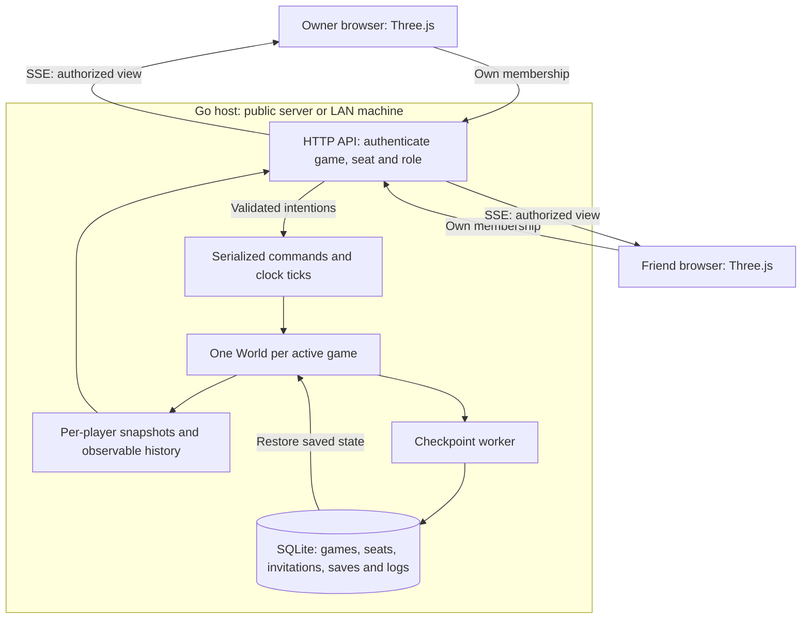
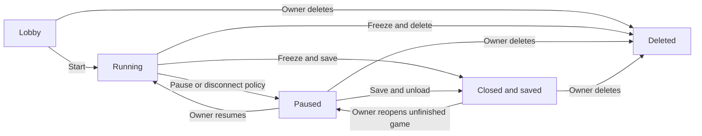

# Multiplayer and portable games

**Status: proposed design, not implemented.** Friend seats, invitations, portable
archives and multiplayer management controls are the next implementation.

A game has a durable identity and one authoritative Go simulation. A server is
where it currently runs. Each human has a membership bound to a player seat;
changing browsers or servers must not create a new civilization. The game owner
and the operator of its server are distinct roles.

## Create, invite and play

```mermaid
flowchart LR
    Creator[Create game] --> Lobby[Saved private lobby]
    Lobby --> Seats[Choose world and human or AI seats]
    Seats --> Invite[Create invitation for a friend seat]
    Invite --> Link[Owner shares invite link]
    Link --> Claim[Friend claims that seat]
    Claim --> Ready[Players choose civilizations and ready up]
    Ready --> Start[Owner starts the game]
    Start --> World[Go creates the world and starts its clock]
    World --> Rejoin[Leave and rejoin the same kingdom]
```



Creating a game opens a saved lobby without starting the simulation. Initially
support six total civilizations, matching the current game limit. All human
seats must be claimed and ready before Start; changing rules clears readiness.
Go generates and checkpoints the world from the finalized roster before admitting
gameplay commands. The roster and map then stay fixed. A replacement invitation
can recover or explicitly reassign an existing seat while preserving its kingdom
and revoking its old credentials. Adding new civilizations midgame is separate.

An invitation grants one seat in one game. Claim it atomically so simultaneous
claims cannot both win. Invitations expire and can be revoked. Opening a link
shows a join screen; an explicit Join POST consumes it, so link previews cannot
accidentally claim seats. Exchange the invite secret for that member's credential
and remove it from the displayed URL. Store credential and invite hashes on the
server. Friends never receive the owner's token.

For example, `https://play.example.com/join#invite=<secret>` keeps the secret out
of the initial HTTP URL. The UI can POST it to `/invites/inspect` for a join
preview, then `/invites/claim` after the friend chooses Join. Inspection never
consumes the invitation.

Issue a private rejoin code and bind the membership to the current browser
session. The code recovers that seat in another browser or on another host.
Rotating one member's credentials does not log everyone out. Membership IDs are
game-local; hosted accounts can be linked later, but LAN play does not require an
external login provider. Saved-game listing, lookup and reopening require the
appropriate membership or ownership. Names and IDs alone never grant access.
Use HTTPS for public hosting and keep invite secrets out of server logs.

## Authoritative runtime



Keep the existing HTTP command and SSE snapshot transport. Go owns physics,
economy, AI, fog and game time. Each host can run multiple games, each serializing
its own inputs and ticks. Browsers never elect a peer to simulate the world.

Authentication resolves an access object with game ID, membership ID, player ID
and permissions. Commands, placement, views and logs use this authenticated
player, rather than a caller-supplied acting player ID. The global chronicle
remains filtered by what each player may observe. Human seats do not run AI.

Scope command deduplication to `(game_id, membership_id, command_id)`. Apply both
per-member and per-game admission limits. Fence old connections with the runtime's
hosting epoch. Reconnection receives a fresh authorized snapshot and log cursor;
it does not replay client-side physics.

Append membership changes, pause/resume, close/reopen and transfer actions to a
game audit log with the actor and intended audience. Preserve existing entity
histories. Both logs travel with the game; invitation and recovery secrets never
appear in them.

## Pause, leave, close and delete



This is the player-facing flow. Internally, session availability, simulation
pause and runtime residency have separate state owners, described below.

| Action | Effect | Retained state |
|---|---|---|
| Pause | Stop the shared game clock; keep control connections available | World and memberships |
| Leave / close browser | Disconnect that browser; reserve its kingdom | World and that player's seat |
| Close game | Freeze, checkpoint and unload for everyone; block new joins | World, roster, history and recovery credentials |
| Reopen | Open an unfinished game paused; players reclaim their seats | Original IDs and progress |
| Delete game | Freeze, disconnect everyone, revoke access and remove this host's game data | Minimal operational deletion marker only |

Suggested private-game policy: any player can pause; the owner starts, resumes,
changes speed, closes, moves or deletes. A disconnected human seat triggers a
pause after a 15-second real-time grace period. With no connected humans, pause
immediately and checkpoint before unloading. Heartbeats detect crashes; browser
close notifications are only a hint. Losing one tab does not disconnect a player
who still has another authenticated connection.

Rejoining never automatically resumes. The owner can explicitly continue without
an absent player; its kingdom keeps its existing orders. AI takeover requires a
separate chosen policy. Server restart and archive import open unfinished games
paused and add no offline time. Finished games reopen for viewing only.

Pause and Resume must be explicit, idempotent operations. The current toggle is
unsuitable: two concurrent Pause requests could resume the game. Shared control
requests also check a control revision so a stale Resume cannot undo a newer
Pause. Durable close/move/delete responses distinguish pending work from success.

Expose **Leave game** to participants. Put owner-only **Close game**, **Move game**
and **Delete game** in the game menu and saved-game library. Delete confirmation
names the game and the saves/history being removed. Closing is reversible;
exported files and external backups are outside this host's deletion scope.

## State-machine ownership

Use `open-ships/statemachine` with typed events, pure guards, named effects and one
instance per lifecycle:

| Owner | Lifecycle |
|---|---|
| Game session | Lobby → Open → Closing → Closed; Reopen; Deleting → Deleted |
| Existing World match | Running ↔ Paused → Finished; sole owner of pause/result |
| Seat membership | Vacant → Reserved → Claimed → Retired; disconnect preserves claim |
| Lobby readiness | Not ready ↔ Ready; rule/roster changes invalidate readiness |
| Invitation | Issued → Claimed, Expired or Revoked |
| Connection | Connected ↔ Disconnected; does not change seat ownership |
| Runtime/transfer | Serving → Quiescing → Frozen → Released |

An Open session may contain a running, paused or finished World. It does not
duplicate the World's pause state. Reopening a closed lobby returns to the lobby;
reopening a saved World preserves its terminal result or opens it paused.
Connection liveness is reconstructed after restart, while memberships persist.

Follow the existing shutdown barrier: freeze commands and ticks, do SQLite work
outside guards/effects, then emit the result event. Close completes only after a
successful save. A failed save leaves a frozen, recoverable game with Retry or
Cancel close; cancellation returns to an open, paused game.

Deletion fences queued commands and autosaves before its transaction removes
checkpoints, logs, memberships and invitations. Retain a game-ID/epoch tombstone
to reject stale writes: late autosaves must never recreate a deleted session.
Restoring a deleted game's external archive is an explicit copy with a new ID.

## Move servers or play on a LAN

```mermaid
sequenceDiagram
    participant Owner as Game owner
    participant Source as Current Go host
    participant Target as New Go host or LAN machine
    participant Friends as Friends' browsers
    Owner->>Source: Move this game
    Source->>Source: Freeze ticks and commands at tick T
    Source->>Source: Commit checkpoint, receipts, logs and transfer marker
    Source-->>Owner: Private portable game archive
    Note over Source: Source stays frozen; ordinary Resume is refused
    Owner->>Target: Import archive and prove ownership
    Target->>Target: Validate version and commit complete import
    Target-->>Owner: Same game and seats, opened paused at tick T
    Owner-->>Friends: Share new game address
    Friends->>Target: Authenticate membership with rejoin code
    Owner->>Target: Resume
    Target-->>Friends: Authorized snapshots from restored World
```

A versioned `.aoegame` archive contains a manifest and a consistent game-scoped
database export: IDs, roster, options, lifecycle states, RNG, tick/time and clock
fraction, entities, orders/queues, fog/memory, immutable logs and their audiences,
command receipts, credential hashes and invitation state. Exclude other games,
account-provider tokens, browser sessions and live connections. Treat the archive
as private game data and support passphrase protection.

The source durably enters transfer mode before publishing the archive. The
destination validates rules/checkpoint versions and commits the complete import
atomically. Game, membership and kingdom IDs stay stable; the hosting epoch and
host-local browser sessions change. Reimporting the same transfer at a destination
is idempotent. Moving revokes pending invitations; issue new ones at the target.

Reachable hosts can exchange a completion receipt to retire the source. An
offline handoff carries the archive to the new machine while the original stays
frozen. Import failure preserves the source and archive for retry. Offline
cancellation must be explicit and requires ensuring a destination copy is not
already playing.

An offline archive can be duplicated. Strict global enforcement of one running
copy across disconnected hosts requires an online coordinator. Normal Move
freezes the source and detects local duplicates. **Copy as new game** deliberately
creates a new game ID and credentials. LAN operation should not require a central
coordinator.

Keeping the same domain can preserve the address. Changing domains or LAN IPs
requires new links and authentication on the new origin; stable game IDs alone
do not redirect old URLs. An optional directory/redirect could help hosted moves
later. LAN players open `http://<machine-address>:9090` with the Go application
listening on that machine's LAN interface, without an Internet login dependency.
Moving an entire SQLite database is a whole-server operator action; archives move
one selected game.

Keep ten-second autosaves. Planned close/move and graceful shutdown commit the
final frozen state. A crash restores the last committed checkpoint and can lose
progress and command receipts since it. Zero loss of acknowledged commands would
additionally require durable input logging/replay; periodic saves alone do not
provide it.

## Proposed API

Routes below are relative to `/api/v1`. Keep current `/matches` routes as
authenticated single-player adapters during migration; do not expose their
current unauthenticated name-based resume on a public host.

| Intent | API | Permission |
|---|---|---|
| Create / list my games | `POST /games`, `GET /games` | Allowed creator / authenticated memberships |
| Configure seats | `POST /games/{g}/seats`, `PATCH /games/{g}/seats/{s}` | Owner, in lobby |
| Invite / revoke | `POST /games/{g}/seats/{s}/invites`, `DELETE /games/{g}/invites/{i}` | Owner |
| Preview invitation | `POST /invites/inspect` | Invite holder; no claim mutation |
| Claim invitation | `POST /invites/claim` | Valid invite holder |
| Recover membership | `POST /memberships/rejoin` | Member's rejoin code |
| Ready / start | `PUT /games/{g}/seats/{s}/ready`, `POST /games/{g}/start` | Own seat / owner |
| Play / observe | `POST /games/{g}/commands`, `GET /games/{g}/events`, `GET /games/{g}/log` | Member, filtered by player |
| Pause / resume | `POST /games/{g}/pause`, `POST /games/{g}/resume` | Pause policy / owner |
| Leave connection | `POST /games/{g}/connections/{c}/leave` | That connection's member |
| Close / reopen | `POST /games/{g}/close`, `POST /games/{g}/reopen` | Owner |
| Freeze for transfer | `POST /games/{g}/transfers` | Owner |
| Download transfer | `GET /games/{g}/transfers/{t}/archive` | Owner |
| Import transfer/copy | `POST /game-imports` | Import permission and archive ownership proof |
| Delete | `DELETE /games/{g}` | Owner, with explicit UI confirmation |

Lifecycle-changing requests use idempotency keys. Generate TypeScript/OpenAPI
from Go DTOs as today; the frontend projects availability, status and failure
reasons from the server.

## Changes from today's implementation

- World commands/views already accept player IDs, but creation marks every
  player after player 1 as AI. Build from the finalized human/AI roster instead.
- `internal/matches/service.go` has one token hash and invokes View, Apply, Log
  and Placement for player 1. Replace this with membership access and scoped
  command receipts.
- `internal/matches/store.go` lists/resumes local games without membership
  authentication and rotates the whole game's token. Names and IDs must become
  lookup keys behind authorization.
- `web/src/api.ts` calls whole-game Leave on browser close. Replace it with
  connection departure and server presence policy.
- Checkpoints, safe shutdown and a destructive delete endpoint already exist.
  Add durable close/reopen semantics and owner controls; deletion must also
  remove the new membership and invitation records.

Implement member isolation and human seats first, then lobby/invite/rejoin,
pause and owner close/delete, then portable handoff. Validate with independent
Chrome contexts, concurrent invite claims, disconnect/rejoin, authorization
refusals, pause races, restart, transfer between two Go processes, import failure,
and a queued autosave racing deletion.
