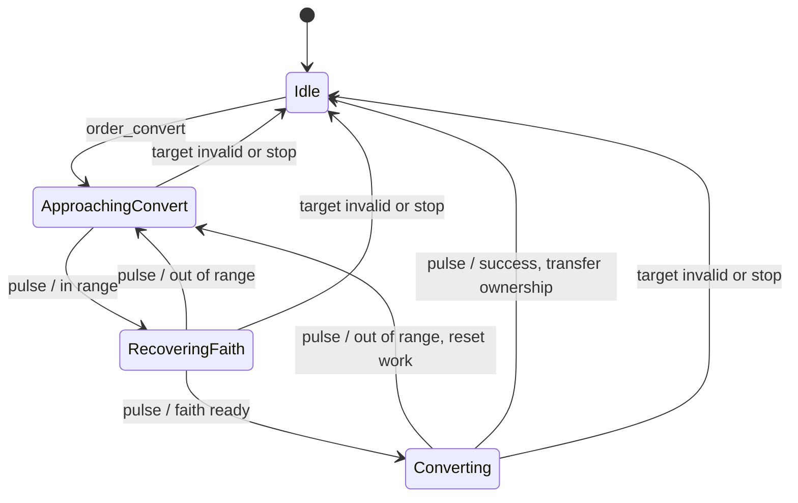

# Lifecycle design

Every gameplay lifecycle follows the same protocol: **state + event + pure guard → next state + named effect**. Different concerns own different instances. An entity can be alive, attacking, and deployed concurrently without one giant Cartesian-product machine.

The backend uses `github.com/open-ships/statemachine` v1.4.1. Each aggregate owns private typed `Instance` fields. Shared compiled tables describe legal transitions. `Instance.Fire` evaluates ordered guards, executes the chosen effect, and publishes the destination state only after that effect succeeds. `Machine.Next` and `Permitted` only inspect possible transitions; neither executes effects.

## Owners

| Concern | Main states | Transition definitions |
|---|---|---|
| Unit behavior | Idle, guarding, moving, work, approach, attack windup/cooldown, garrisoned | `internal/game/machines.go`, `guard.go`, `movement.go`, `economy.go`, `combat.go`, `monks.go` |
| Entity life | Foundation, active, exhausted, destroyed | `internal/game/lifecycle.go` |
| Production | Idle, working, blocked | `internal/game/production.go` |
| Siege deployment | Packed, deploying, deployed, packing | `internal/game/lifecycle.go` |
| Projectile flight | Flying, impacted | `internal/game/combat.go` |
| Player participation | Competing, defeated | `internal/game/lifecycle.go` |
| Civilization strategy | Developing, defending, raiding, recovering | `internal/game/ai_strategy.go` |
| Initial peace period | Active, expired | `internal/game/treaty.go` |
| Naval expedition | Idle, boarding, sailing, landing, returning | `internal/game/ai_naval.go` |
| Market offer | Draft, open, filled, cancelled | `internal/game/trade_offers.go` |
| Commodity delivery | Reserved, outbound, returning, returning payment, delivered, recalled, lost | `internal/game/trade_shipments.go` |
| Merchant supply | Preparing, travelling | `internal/game/merchant_regions.go` |
| Destruction remains | Present, expired | `internal/game/aftermath.go` |
| Pairwise relationship | Peaceful, hostile | `internal/game/diplomacy.go` |
| Match | Running, paused, finished | `internal/game/lifecycle.go` |
| Server session lease | Open, draining, closed | `internal/matches/lifecycle.go` |
| Match service | Serving, draining, closed | `internal/matches/lifecycle.go` |

Construction belongs to entity life; construction work belongs to the worker's behavior. Research and age advancement use production, whose completion effects publish the technology or new age. Trading, gathering, healing, conversion, relic handling, embarking, and unloading are unit behavior branches.

## Independent civilization strategy

Each player's strategy instance receives an assessment every two game seconds while controlled by AI. The observation builder reads its own economy and units, visible foreign entities, and remembered buildings. It never uses foreign controller identity, hidden production/resources, or starting coordinates to score targets. Target value and risk are ordinary calculations; ordered transition guards decide whether to develop, raid, defend, or recover.

An actual recent attack near the economy interrupts every other strategy; proximity alone does not. A seeded preference is static configuration, separate from strategy state: Builders avoid raids and fund small defenses, Defensive kingdoms can counter-raid existing hostilities, and Expansionists may initiate profitable conflicts. Raids end when peace invalidates a defensive counter-raid, their objective is gone, their time budget expires, losses become excessive, or newly observed defenses overwhelm the expedition. Recovery has a fixed deadline, and a separate earliest-next-raid timestamp prevents rapid relaunches. Each raid owns a fixed roster within the difficulty's cap; reserve and newly trained units stay home. Production budgets include queued units across all buildings. Easy's worker order spacing changes its planning cadence, not the underlying production clock.

Named effects submit ordinary validated commands. Repeated assessments preserve active movement and combat orders, and only committed strategy changes emit private notices to that kingdom. The instance owns the strategy state; `AIPlan` stores only objectives, rosters, bounded scouting data, and deadlines. Both are checkpointed without replaying effects. Version-1 and version-2 saves initialize peaceful relationships, recall old AI attacks for reassessment, and retain their entities, economy, and immutable histories.

## Peace and return fire

Each unordered pair of kingdoms owns one relationship instance. `aggression` moves Peaceful to Hostile, notifying each affected kingdom once. Further attacks renew the quiet deadline through a Hostile self-transition. A guarded `pulse` restores Peaceful after 300 game seconds without attacks. Guards only read the clock; named effects own deadlines and notices. Attack release, projectile impact (including splash), and conversion attempts emit aggression; mere acquisition and passing units do not.

Recent incidents identify the actual attacker, victim, position, and time. These are bounded observation facts, expired after 15 game seconds, rather than another lifecycle owner. Default idle units acquire only recent actual attackers of themselves or nearby friends. Their existing behavior instance owns chase, windup, and cooldown; a guard ends retaliation when the attacker disappears, the incident expires, or pursuit exceeds its six-tile anchor. Hold fire cancels automatic combat. Explicit attack orders carry provenance and remain intentional; AI attack-move orders also carry a kingdom scope so they do not attack unrelated bystanders. A scoped march can temporarily retaliate and then resume its original scope.

Stances and AI preferences are configuration, not copies of lifecycle state. Relationships, incident facts, attack provenance, pursuit anchors, and scopes persist in version-3 checkpoints without replaying effects. Public snapshots expose relationship status and preferences, plus the player's own selected stances; they do not expose AI objectives or foreign orders.

## Conversion example

The first applicable row wins. Target invalidation therefore precedes range and success rows. The conversion effect transfers ownership, resets faith, refunds the former owner's production queue through that machine, and ends the order. A later pulse cannot repeat those effects because the actor has left `Converting`.

The scheduler prepares target observations and samples a conversion roll into event data. A guard never consumes random numbers. Reading available actions or evaluating a transition twice cannot affect the simulation's future.

## Consistency and interruption

- The match service serializes commands and fixed simulation steps under one match lock. Effects see a consistent world.
- Each lifecycle has exactly one mutable state owner. DTO booleans such as `paused`, `defeated`, and `deployed` are computed projections.
- A behavior command enters the machine through an event. Stop or replacement orders clear appropriate work, path, and queue data through transition effects.
- Effects may fire a *different* instance, such as construction work on a target's life machine. They must never synchronously fire their own instance, including an indirect cycle through another machine. Queued actor orders dispatch only after the current event commits.
- Full-selection and payment prerequisites are checked before irreversible domain mutations. An invalid queued building request cannot pay for an unusable foundation.
- A missing transition is a refusal. External refusals become API errors; impossible internal transitions fail tests rather than silently assigning a state.
- `Fire` does not roll back arbitrary Go mutations. Effects validate first and avoid fallible I/O. Cross-machine mutations must preserve their own invariants; this is not a database transaction facility.
- Destroyed entities, impacted projectiles, defeated players, and finished matches cannot resume their former lifecycle.

The tick driver in `simulation.go` emits pulses. Tables decide progress, interruption, completion, blocking, and cleanup. Numeric accumulation such as movement, healing amounts, faith recharge, and relic income remains ordinary arithmetic; state-specific effects call it where appropriate.

## Where a switch is appropriate

Routing a command kind, selecting a resource field, or choosing a rendering model is ordinary dispatch. A switch that decides whether a lifecycle advances, fails, completes, or cleans up duplicates the transition table and belongs in a machine instead. A collection of case handlers that manually assign the next state is not sufficient.

Do not add machines for static configuration, coordinates, costs, counters, or pure algorithms. Model the lifecycle around the operation, not each calculation inside it.

## Adding a lifecycle branch

Declare typed states/events, add ordered rows with pure guards and named effects, and initialize its instance at aggregate creation. Expose only necessary presentation state through DTOs. Test valid progress, interruption, refusal, terminal behavior, and one-time effects. Extend the generated API contract only if clients need new intentions or observations.

## Checkpoint restoration

`internal/game/checkpoint.go` captures the state of each lifecycle owner alongside
the private world data, timers, routes, and RNG. Restoration validates the format
and states, then creates each `Instance` at its saved state. It does not replay
creation or transition effects. The saved values are serialization data, not a
second live state owner. Add any new lifecycle to checkpoint capture, restoration,
and continuation tests when extending the game.

The match service commits the checkpoint, command receipts, and new immutable
journal records in one SQLite transaction. Journal audiences are preserved from
the moment of each event. An idle or explicitly unloaded lease closes only after
saving. Loading a saved session creates a new lease without changing the game's
running, paused, or finished state. SQLite I/O remains outside simulation effects
and guards.

For process shutdown, `begin_shutdown` takes the service from Serving to Draining.
Its named effect broadcasts shutdown and freezes each lease under its match
lock. The mutation barrier waits for already executing commands and ticks;
subsequent commands, including requests holding old authorized handles, are
refused. Draining preserves receipts and the fractional simulation clock until
checkpointing completes. The scheduler exits, and the transport uses the same
shutdown notification for request admission and SSE cancellation.

HTTP draining and SQLite checkpoint I/O run outside transition effects. After
the final save attempts and database closure, `finish_shutdown` moves the service
to Closed and releases its leases through their named cleanup effect. A failed
save still terminates the process, reports the affected session and returns an
error; it never acknowledges a partial checkpoint. Repeated shutdown requests
are no-op transitions, and repeated or concurrent close calls return the original
result without repeating saves or cleanup. Restarts construct new service and
lease instances; these process lifecycles do not replace persisted game states.

## World creation and initial peace

World options are immutable creation configuration, not another lifecycle. Pure seeded generation calculates terrain and starting positions; Go validates intended connectivity. Biomes are presentation metadata. Terrain components are derived and rebuilt on restore, never an additional state owner.

One world-owned treaty instance receives simulation pulses. The expiry guard reads only the game clock and configured duration; its named effect announces expiry exactly once. Combat, conversion, damage, automatic acquisition and AI opportunity checks consult this instance. Pairwise peace continues independently after expiry. Checkpoint version 4 stores the treaty and every player's naval expedition state; older versions initialize inactive treaties and idle expeditions without replaying effects or regenerating terrain.

Naval expeditions own a transport, crew roster, observed destination and deadlines. The lifecycle boards, sails, unloads and returns through ordinary validated game commands. Ship loss clears reservations; threats or deadlines interrupt boarding and sailing. Crews use the existing unit garrison lifecycle. Land strategy excludes reserved crews and cannot recall landed units across an ocean. AI dock and fishing production uses normal costs, queues and finite resources. Expedition state and objectives survive checkpoint resume.

## Explicit economy actions

The `reseed_farm` command and automatic farmers share the existing Exhausted → Foundation `ReseedFarm` transition. A read-only plan chooses the assigned farmer or nearest idle villager on connected land; the farm effect charges wood and restores yield once, and the worker receives a normal build order. Interruption leaves a resumable foundation. Checkpoint restoration does not repeat the payment.

Fishing uses the ordinary seeking, gathering, returning and natural-resource depletion lifecycles, with naval reachability and Dock delivery. Market exchanges are instantaneous validated transactions, not additional lifecycles. Snapshot actions and command execution share the quote function. New funded cart and ship deliveries use the shipment machine described below; Trading and ReturningTrade only drain legacy cargo from older checkpoints.

## Private game sessions and portability

`internal/matches/room_machines.go` defines separate owners for session availability (Lobby/Open/Closing/Closed/Deleting/Deleted), seat claims, readiness, invitations, connections and runtime handoff (Serving/Quiescing/Frozen/Released). `World.match` continues to own Running/Paused/Finished; the session never duplicates that state. The existing server lease fences stale handles when a runtime unloads or shuts down.

Readiness is optional and is invalidated by roster or world changes, with a distinct revision for that content. A peer marking Ready does not invalidate another peer's response or the owner's Start. Start requires the current world settings but permits vacant, reserved and unready friend seats. Unclaimed human kingdoms do not run AI or trigger disconnect pauses; a late claim preserves their entities and the current clock. Shared Pause/Resume are explicit idempotent events, with a control revision on authenticated snapshots fencing stale Resume. Human players never pulse AI strategy machines.

State effects freeze or mutate in-memory state. SQLite I/O happens afterward under the mutation barrier. Failed close leaves Closing and a paused World; Retry checkpoints again and Cancel returns Open/Paused (or Lobby). Transfers persist the frozen marker, archive, receipts and journal in one transaction before download. Import restores existing lifecycle instances without replaying effects, gives the runtime a new epoch and opens paused. Deletion writes a tombstone before removing the game, so a stale save cannot resurrect it.

## Marketplace ownership

Each listing owns one offer instance. Post reserves all offered lots; fill transfers one lot into a new shipment; cancel releases only unclaimed lots. Each shipment owns one delivery instance. Its effects load payment, move the assigned cart or ship, exchange cargo at the matching partner Market or Dock, return goods, recall payment, or settle loss. The unit behavior instance owns whether the cart is following the caravan intention or interrupted by a normal move/stop. It does not duplicate the delivery phase. The simulation emits shipment pulses after unit/projectile updates; continuation commands dispatch only after delivery commits.

Guards only inspect funds, terms, ownership, observations, route connectivity and lifecycle state. Inventory, price formulas and movement are ordinary data/math, not additional state machines. Checkpoint version 7 stores offer, shipment, supply and destruction-remains states separately, deep-copies records for background encoding, and restores without replaying payments, refunds or replenishment. Version-5 merchant inventory is distributed without duplication; older checkpoints initialize regional merchants without regenerating resource deposits.

Each merchant region owns one supply instance: Preparing → Travelling on a due, feasible departure; Travelling → Preparing on arrival or loss. Named effects create the physical neutral caravan, move it through normal pathfinding, deliver bounded output, settle bounded consumer purchases, or discard lost cargo. The region holds the sole in-transit payload authority, keyed to its physical cart. No second timer restocks its warehouse. New trips wait 90 seconds after arrival or loss; a blocked trip cannot overlap or accrue catch-up deliveries. The cart's ordinary unit lifecycle stays idle; the supply lifecycle alone owns this journey and movement.

Merchant shipments use the existing delivery machine with a separate guarded merchant-launch event. Launch reserves the regional stock and loads the accepting player's cart in one effect. Collection credits the local merchant, then returning cargo settles at home. Recall/loss releases only uncollected reserved goods. Inbound and refundable warehouse commitments are derived from active shipment states. Repetition is dispatched through `World.Apply` after delivery commits and honors current local prices and the stored limit. The former distance-gold route only drains already-loaded legacy cargo once; new routes cannot enter it through a trade command.

## Escorts, captured cargo and destruction

A Guard order remains owned by the unit behavior instance. `Order.Target` is the protected entity and `Order.Threat` is the temporary combat target. Guarding enters Chasing through a named engagement effect; the existing combat windup and cooldown rows execute attacks. Higher-priority guarded rows return to Guarding when the enemy leaves sight or pursuit range, and end the order when its charge becomes invalid. There is no second combat controller, duplicated suspended order, or nested self-fire. Normal command queuing dispatches after the current event commits. The owner alone receives `guard_target` in snapshots.

A lethal `DamageEntity` transition captures carried resources before removing the entity. Its source owner comes from the attack or projectile, not client input. Regular cargo is cleared once, and shipment loss releases only goods never collected. For a regional supply cart, the lethal effect fires the region’s `raided` event: Travelling → Preparing awards and clears the region’s sole authoritative cargo, records the loss and schedules the next departure. This supply effect does not remove its actor or re-enter the actor’s life instance; the original lethal transition completes removal afterward.

Go derives damage stage from current health rather than storing a second mutable condition. Confirmed lethal damage creates one world-owned aftermath instance, Present → Expired on a game-clock pulse. Renderer poses, flames, smoke and crumbling are projections of these authenticated observations. Effects obey ordinary sight and are persisted with their lifecycle state, without replaying the lethal transition or spoils on restore. Pause stops expiry; deletion and fog disappearance never create battle remains.
